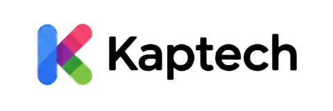

  
   
  <h3>Simple, Practical, and Modern Utility Applications</h3>
  
Automating and simplifying your digital ecosystem with high-performance tools.

---

## 🚀 Vision & Expertise

**Kaptech Development** berfokus pada pengembangan perangkat lunak yang solutif, ringan, dan modern. Kami menggabungkan keahlian _Fullstack Development_ dengan pemahaman mendalam pada optimasi alur kerja digital.

---

## 📱 Android Development

_Aplikasi mobile yang didesain untuk kenyamanan spiritual dan pertumbuhan digital._

- **Counter Tasbih Pro: Zikir App** - Tasbih digital premium dengan fitur tracking harian.
- **RiseSocial: Profil Booster** - Optimasi kehadiran media sosial dengan alat analisis canggih.

---

## 🌐 Chrome Extensions & Automation

_Automasi browser yang cerdas untuk meningkatkan efisiensi kerja._

- **FB Web Auto Comment Bot** - Automasi komentar Facebook multi-payload.
- **YT Shorts Pro Automation** - Sistem scroll dan komentar otomatis untuk meningkatkan engagement.
- **Social Scrapers (TT & IG)** - Ekspor data followers ke CSV dengan simulasi perilaku manusia.

---

## 📈 Algorithmic Trading (MQL5)

_Sistem eksekusi perdagangan presisi untuk pasar finansial._

- **ea_BMAAutoEntryKaptech** - Scalping presisi untuk XAUUSD M1.
- **ea_autoRunAgresif (Buy/Sell Layer)** - Sistem entry agresif dengan manajemen risiko otomatis.
- **Universal SLTP Manager** - Pengelola Stop Loss dan Take Profit otomatis untuk seluruh posisi.

---

## 🛠️ Technology Stack

- **Languages:** Kotlin, JavaScript (ES6+), HTML5, CSS3, MQL5.
- **Android Stack:** Jetpack Compose, Coroutines & Flow, Room (Local Database), Multi-Module Project.
- **Architecture:** Clean Architecture, MVVM (Model-View-ViewModel), MVP Pattern.
- **Integrations:** Google Play Console, Firebase (Analytics, Auth, DB), AdMob.
- **Web Models:** Full Vanilla Architecture (Zero Dependencies).
- **Design:** Modern Glassmorphism & Professional Minimalist.

---

## 📧 Get In Touch

Jika Anda memiliki pertanyaan atau kebutuhan custom automation, silakan hubungi tim kami:

- **Email:** ss.infowe@gmail.com
- **Portfolio:** [sahrulsidik.github.io](https://sahrulsidik.github.io/)

---

  
&copy; 2026 KAPTECH DEVELOPMENT. ALL RIGHTS RESERVED.

